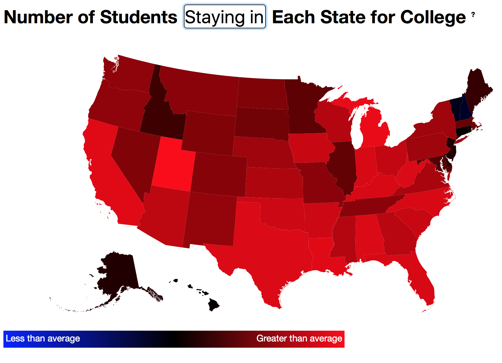

# College Flow Map

## About
The purpose of this map is to illustrate the flow of US college students between states. In other words, it aims to show which regions of the country are more popular college destinations and which ones are more likely to be left behind. It also includes data for in-state students, but as in-state students make up a large percentage of each state's college population, the patterns are not as distinct as they are for out-of-state students.

The college data is from 2015, and it was compiled from [the College Board's website](https://research.collegeboard.org/programs/ap/data/archived/ap-2015).

The visualization was created using [D3.js](https://d3js.org), [GeoJSON](http://geojson.org) data [from the 2010 US Census](http://eric.clst.org/Stuff/USGeoJSON), and a JSON version of the College Board's data set that I created using [Node.js](https://nodejs.org/en/) and the [xlsx npm package](https://www.npmjs.com/package/xlsx). The JSON data also includes juvenile population estimates from 2015, which were obtained [here](http://datacenter.kidscount.org/data/tables/99-total-population-by-child-and-adult).

There are some screenshots below, but a live version is available [on my website](https://cameronbernhardt.com/College-Flow-Map/).

## Data compilation
Collecting the data for this visualization was a bit of a sporadic process, but I'll attempt to summarize it.

I started by downloading a copy of the College Board's data in an Excel file, which is available in this repository under the Data folder.

If I wanted to use this data in my visualization, I needed to store it in a format that would be readable and quickly accessible from my web app (rather than try to parse the Excel file on the fly). I chose JSON for this purpose (although CSV and other formats are compatible with D3) and parsed the Excel file into [this file](https://github.com/AstroCB/College-Flow-Map/blob/master/Data/state_data.js). It also includes population estimates that I scraped from [this site](https://github.com/AstroCB/College-Flow-Map/blob/master/Data/pop_data.js) for the juvenile (under 18) population of each state, which were used in an earlier formula but are not present in the current visualization calculation.

Lastly, I needed a map of states to display the information, so I used [this GeoJSON data](https://raw.githubusercontent.com/AstroCB/College-Flow-Map/master/state_location_data.js), which was converted from the US Census Bureau's [original SHP files from the 2010 Census](https://www.census.gov/geo/maps-data/data/tiger-cart-boundary.html) by Eric Celeste [here](http://eric.clst.org/Stuff/USGeoJSON). I passed this information to D3 and used an [Albers projection](https://en.wikipedia.org/wiki/Albers_projection) to plot it as a map (which, coincidentally, is the same projection that the Census Bureau uses for all of its data).

## How it works
On the simplest level, it searches the JSON College Board data for each state's `entering`, `leaving`, and `in_state` fields, then maps those to a continuous RGB distribution based on their average values (which were computed beforehand using the data and are listed in the `map.js` file).

More specifically, each `entering`, `leaving`, and `in_state` field is balanced by its average value centered around zero and then mapped to an `enteringFactor`, `leavingFactor`, and `stayingFactor`. This mapping occurs by taking each balanced field as a proportion of 255 (the max value of an RGB entry) and then multiplying it by an arbitrary constant to make the distribution more visible onscreen (as most of the data is not displaced very far from its median, so it would otherwise be a very subtle discoloration).

These factors are then used for the red and blue portions of the RGB calculation for each state. The green portion is set at 0 for this visualization, so it will range from blue `(0,0,255)` to black `(0,0,0)`, to red `(255,0,0)`. Red represents an above average measurement, while blue is a below average, and black is equal to or relatively close to the median of the data. For instance, if viewing the "leaving" overlay, red regions will represent states with an above average number of students leaving the state for college, while blue ones will represent states with below average out-of-state numbers, and black ones will represent states closest to the median.

Because green is not involved in the calculation, you could change this value to get different (and probably more aesthetically pleasing) color ranges than the one I've used here as a default. Feel free to play with this value and make a pull request if you're interested in sprucing up the visualization a bit (but don't forget to update the gradient scale below it).
